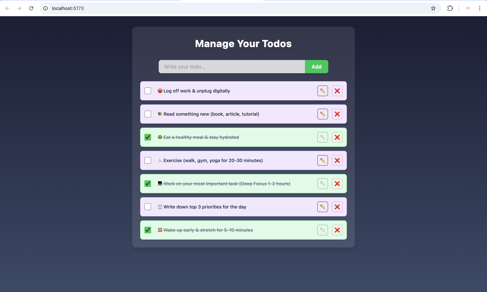

# 📋 **Todo App**



## 🚀 **Project Overview**

This is a sleek, modern, and efficient **Todo List App** built using:
- **React** with **Vite** for fast and optimized development  
- **Tailwind CSS** for elegant and responsive UI  
- **Context API** for clean and scalable state management  
- **Local Storage** for persistent data across sessions  

This application helps users manage tasks, organize priorities, and maintain productivity.

---

## 🔑 **Key Features**

- 📝 **Create Todos:** Effortlessly add tasks to stay organized.  
- ✅ **Mark Complete:** Strike through completed tasks.  
- ✂️ **Delete Tasks:** Easily remove unwanted todos.  
- 💾 **Persistent Data:** Saves todos using local storage, so no data is lost when you close the app.  
- 🎯 **State Management:** Context API ensures seamless data flow and state management across components.


## 🛠️ **Tech Stack**

- ⚛️ **React JS** – Component-based user interface  
- ⚡ **Vite** – Blazing fast build tool  
- 🎨 **Tailwind CSS** – Utility-first CSS framework  
- 🧩 **Context API** – Built-in state management for React  
- 💽 **Local Storage** – Persistent storage for user data  


## 🏗️ **Project Setup**

1. **Clone the Repository**  
   ```bash
   git clone <https://github.com/MUSTAFAREZA47/todo-app.git>
   cd project-folder
   ```

2. **Install Dependencies**  
   ```bash
   npm install
   ```

3. **Run the Development Server**  
   ```bash
   npm run dev
   ```

4. **Build for Production**  
   ```bash
   npm run build
   ```

---

## 🧑‍💻 **How It Works**

1. Enter a task in the input field and click **Add Todo**.  
2. Click a task to mark it as complete or incomplete.  
3. Delete a task using the **Delete** button.  
4. Todos are saved locally — reopen the app without losing tasks.

---

## 🌟 **Learning Highlights**

- Managing state with **Context API** instead of props drilling  
- Styling responsive components using **Tailwind CSS**  
- Leveraging **localStorage** for persistence  
- Building and optimizing apps using **Vite**

---

## 🤝 **Contributions & Feedback**

Feel free to fork the project and submit pull requests for new features or improvements.  
Found a bug or have a suggestion? Open an issue!
